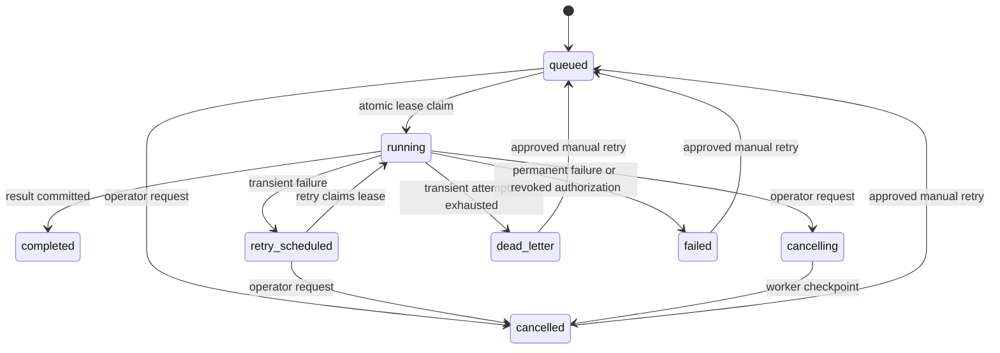

# v0.9 Tenant-Aware Job Delivery Hardening

Status: implemented research prototype on `research/v0.9.0`

## 1. Objective

WP-07 makes Celery delivery an untrusted, repeatable notification rather than the
authoritative job record. PostgreSQL or SQLite remains the source of truth. A worker
must prove the tenant, actor, capability and current lease before it can load a
project, document, learner record or model configuration.

This design addresses:

- duplicate broker delivery;
- worker termination during a paid model call;
- stale or tampered tenant payloads;
- authorization changes between enqueue and execution;
- bounded transient retries;
- operator cancellation;
- explicit terminal and dead-letter states.

It does not claim exactly-once execution across an external provider boundary.
Instead, one persisted job and one atomic lease own the billable result. Provider
idempotency keys should be added when a provider offers that contract.

## 2. Authoritative state

`background_jobs` stores:

```text
identity:
  organization_id
  project_id
  actor_principal_id
  kind
  idempotency_key

immutable envelope:
  envelope_version
  envelope_json
  envelope_digest
  required_capability
  authorization_mode

delivery:
  attempt_count
  max_attempts
  retry_class
  next_attempt_at
  celery_task_id

lease:
  lease_owner
  lease_token
  lease_expires_at
  heartbeat_at

lifecycle:
  cancel_requested_at
  cancel_requested_by
  dead_lettered_at
  terminal_reason
  created_at
  updated_at
  started_at
  completed_at
```

The unique key `(organization_id, kind, idempotency_key)` prevents two logical jobs
from being created for one organization operation.

## 3. Task envelope

Celery receives one JSON object:

```json
{
  "version": 1,
  "job_id": "uuid",
  "organization_id": "uuid",
  "actor_principal_id": "uuid-or-null",
  "kind": "golden_dataset",
  "required_capability": "dataset.manage",
  "authorization_mode": "membership",
  "idempotency_key": "client-or-server-key",
  "payload_digest": "sha256"
}
```

The complete envelope is persisted before dispatch. Its canonical SHA-256 digest is
stored separately. Workers reject unknown fields, versions, kinds, capability
mismatches, payload changes and tenant/actor changes before resource access.

The operational payload remains in the database. It is not trusted from the broker.

## 4. State machine



Terminal states are `completed`, `failed`, `cancelled` and `dead_letter`.

## 5. Lease and duplicate delivery

Claiming uses one conditional SQL update. It succeeds only when:

- the persisted envelope matches;
- the job is queued, retryable, or has an expired running lease;
- no cancellation is pending;
- `next_attempt_at` is due;
- attempts remain.

Only the delivery holding `lease_token` can update progress, heartbeat, complete or
classify failure. A second broker delivery observes the existing state and returns
without invoking the handler. Completed results are returned as duplicate-delivery
replays.

The worker extends the lease from a background heartbeat thread. Long-running
handlers also call cooperative checkpoints before and after expensive operations.

## 6. Execution-time authorization

New enterprise jobs use `authorization_mode=membership`.

Before resource loading, the worker verifies:

- organization is active;
- principal is active;
- organization membership is active;
- the current role still grants the persisted required capability.

The enqueue-time role is not authoritative. Revoking a membership or capability
therefore prevents a queued job from executing.

`legacy_local` exists only for compatibility when authentication is disabled in a
non-production environment. Production rejects this mode.

## 7. Retry, cancellation and dead letter

Deterministic input, tenant, capability and resource errors are permanent.
Timeouts, connection failures, rate limits and bounded upstream 5xx failures are
transient.

Transient failures use bounded exponential backoff:

```text
JOB_RETRY_BASE_SECONDS * 2 ** (attempt_count - 1)
```

Once `max_attempts` is exhausted, the job enters `dead_letter`. Internal exception
messages are not exposed through enterprise APIs; a bounded error code and retry
class are persisted.

Cancellation is cooperative. Queued jobs become `cancelled` immediately. Running
jobs become `cancelling`; Celery receives a non-terminating revoke signal and the
worker commits cancellation at its next checkpoint. The system does not use
`terminate=True`, which could interrupt a database transaction at an unsafe point.

## 8. Worker restart recovery

An expired lease indicates that the prior worker stopped heartbeating. Recovery:

1. selects expired running leases for one organization;
2. clears ownership;
3. cancels jobs with a pending cancellation;
4. dead-letters jobs with no attempts left;
5. places the remainder in `retry_scheduled`;
6. dispatches the original persisted envelope.

Recovery is explicitly tenant-scoped so a restricted PostgreSQL runtime role never
needs cross-organization visibility.

## 9. Enterprise API

```text
GET  /api/v1/jobs/{job_id}
POST /api/v1/jobs/{job_id}/cancel
POST /api/v1/jobs/{job_id}/retry
GET  /api/v1/organizations/{organization_id}/jobs
POST /api/v1/organizations/{organization_id}/jobs/recover
```

Reads require `job.read`; mutations require `job.manage`. Resource IDs from another
organization return 404. Enterprise responses omit Celery task IDs, lease owners,
envelope digests and raw errors.

## 10. Configuration

```env
JOB_LEASE_SECONDS=300
JOB_HEARTBEAT_SECONDS=30
JOB_MAX_ATTEMPTS=3
JOB_RETRY_BASE_SECONDS=10
JOB_RECOVERY_BATCH_SIZE=100
```

Production readiness fails when heartbeat duration is not shorter than lease
duration.

## 11. Migration

Migration `20260728_0013` adds the state and constraints without deleting historical
jobs. Legacy queued or running deliveries are invalidated and marked failed because
their broker messages do not carry a v1 envelope. An operator can retry them, which
builds a current envelope from the persisted payload.

Downgrade refuses while jobs are running, retry-scheduled or cancelling.

## 12. Verification

Deterministic tests cover:

- strict and tamper-evident envelopes;
- idempotent enqueue;
- duplicate delivery with one handler execution;
- authorization revocation before resource access;
- transient retry and dead-letter exhaustion;
- cancellation and stale lease recovery;
- cross-tenant API anti-enumeration;
- migration upgrade, backfill and downgrade.

Still required before v0.9 promotion:

- Redis/Celery process-kill recovery on Linux;
- PostgreSQL concurrent claim stress;
- a real provider call with duplicate broker delivery;
- Vultr worker restart and queue outage rehearsal.
